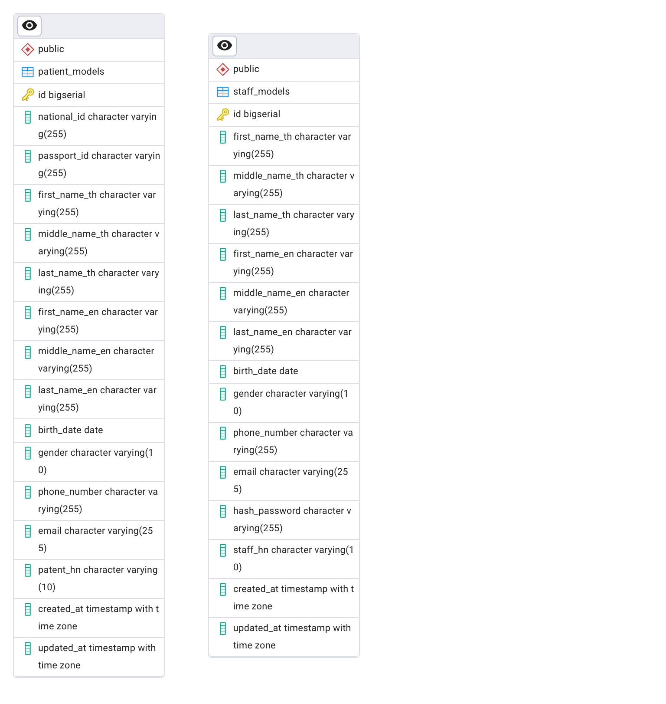

# Hospital Middleware

## Requirements

- docker compose

## Setup Steps

copy `.env.example` to `.env` in /src directory

```
docker Compose up -d
```

run in root directory

```
- curl -l http://hospital-a.localhost/api/v1
```

- if success, you will see `{"message":"Hospital A"}`

```
- curl -l http://hospital-b.localhost/api/v1
```

- if success, you will see `{"message":"Hospital B"}`

## Tests

- Run `go test .` in 'src/tests' directory.

## ERD



## Project Structure

- **Root Directory**
  - `Readme`: Project documentation.
  - `.gitignore`: Specifies files to be ignored by Git.
  - `docker-compose.yaml`: Configuration for Docker Compose.
  - `Dockerfile`: Instructions to build a Docker image.
  - **Directories**:
    - `.git/`: Git repository metadata.
    - `nginx/`: Configuration for Nginx.
    - `src/`: Source code directory.
      - `main.go`: Main application entry point.
      - `go.mod` and `go.sum`: Go module files.
      - `.air.toml`: Configuration for live reloading.
      - **Subdirectories**:
        - `tmp/`: Temporary files.
        - `tests/`: Test files.
        - `routes/`: Contains `routes.go` for API routing.
        - `core/`: Core application logic.
        - `staff/`: Staff-related logic.
        - `pkg/`: Package utilities.
        - `models/`: Data models.
        - `config/`: Configuration files.

# API SPEC

### Health Check

- **Endpoint**: `GET /api/v1`
- **Description**: Returns a health check message with the hospital name.

### Staff Routes

- **Register**

  - **Endpoint**: `POST /api/v1/staff/register`
  - **Description**: Registers a new staff member.
  - **Request**:
    - headers:
      - `Content-Type`: `application/json`
      - `Accept-Language`: `th` or `en`
    - payload:
      - `email (required)`: Staff email.
      - `password (required)`: Staff password.
      - `first_name_th (required)`: Staff first name in Thai.
      - `middle_name_th (required)`: Staff middle name in Thai.
      - `last_name_th (required)`: Staff last name in Thai.
      - `first_name_en (required)`: Staff first name in English.
      - `middle_name_en (required)`: Staff middle name in English.
      - `last_name_en (required)`: Staff last name in English.
      - `birth_date (required)`: Staff birth date.
      - `gender (required)`: Staff gender.
      - `phone_number (required)`: Staff phone number.
      - `staff_hn (required)`: Staff hospital number.
  - **Response**:
    - success:
      - status: 200
      - payload:
        - `access_token`: Access token.
        - `id`: Staff ID.
    - error:
      - status: 400
      - payload:
        - `reason`: Invalid request.
        - `reason`: Email already exists.
        - `reason`: Failed to hash password.
        - `reason`: Failed to create staff.
      - status: 500
      - payload:
        - `reason`: Failed to hash password.
        - `reason`: Failed to create staff.

- **Login**
  - **Endpoint**: `POST /api/v1/staff/login`
  - **Description**: Authenticates a staff member.
  - **Request**:
    - headers:
      - `Content-Type`: `application/json`
      - `Accept-Language`: `th` or `en`
    - payload:
      - `email (required)`: Staff email.
      - `password (required)`: Staff password.
  - **Response**:
    - success:
      - status: 200
      - payload:
        - `access_token`: Access token.
        - `id`: Staff ID.
    - error:
      - status: 400
      - payload:
        - `reason`: Invalid request.
        - `reason`: Invalid password.
      - status: 500
      - payload:
        - `reason`: Failed to generate tokens.
